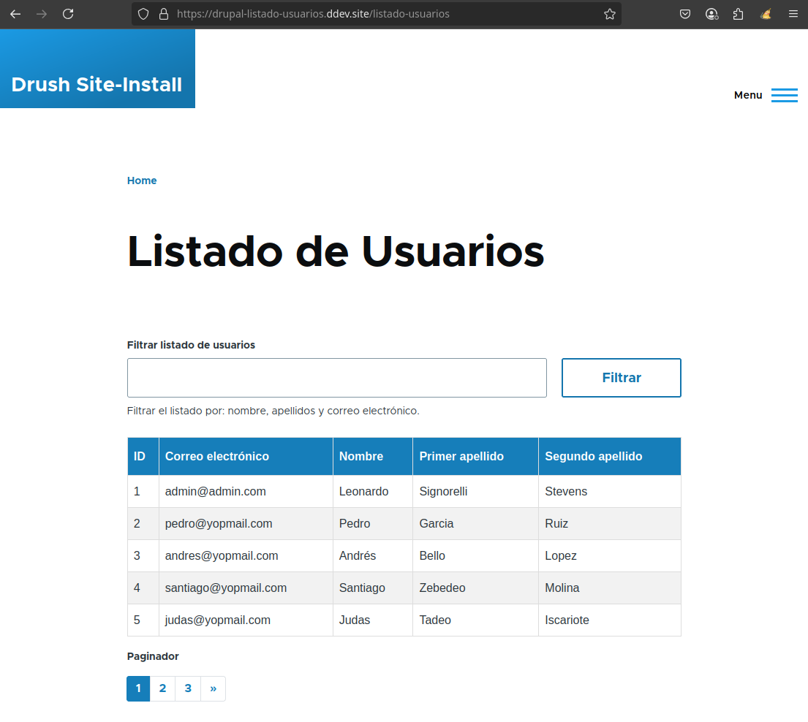
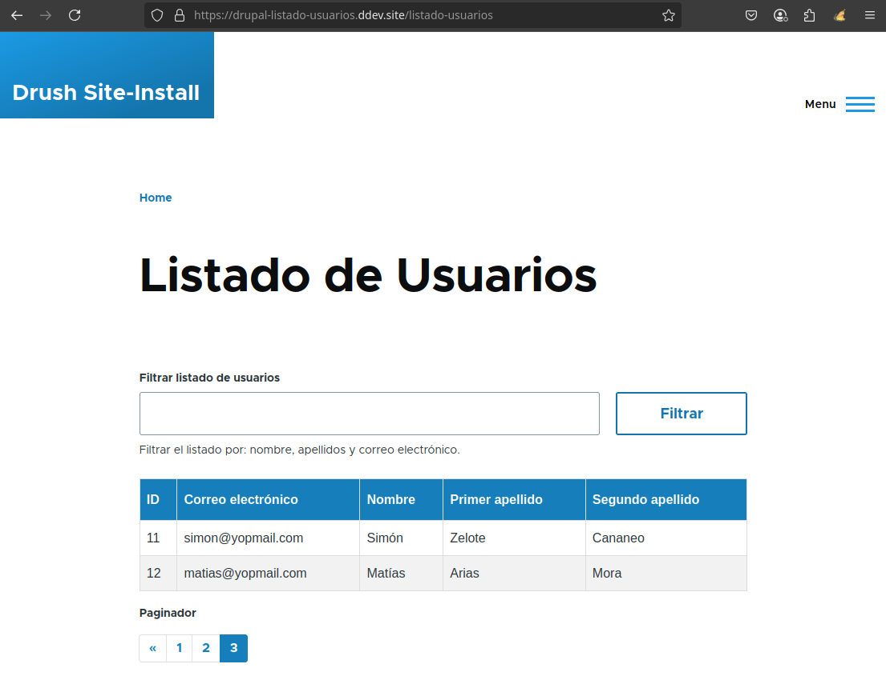
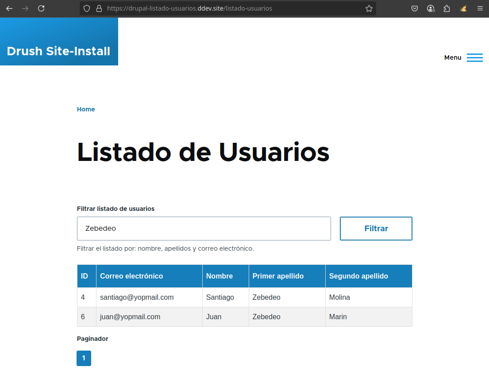
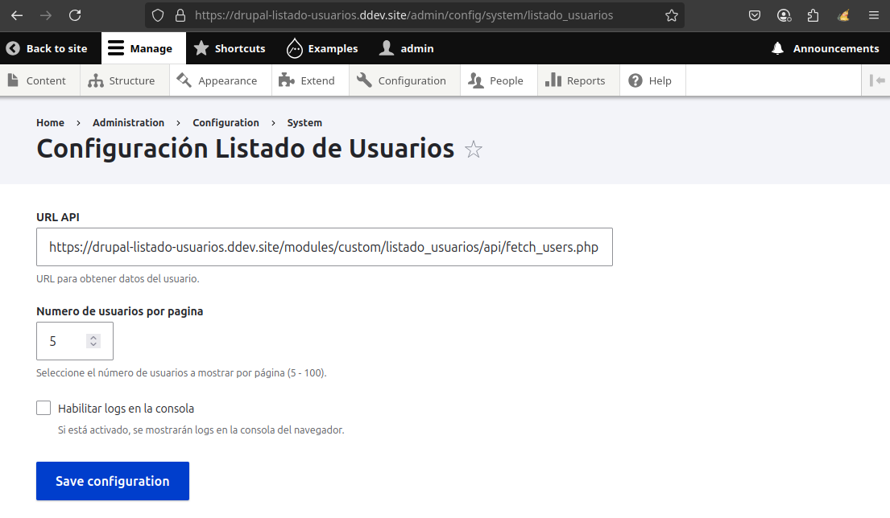

# Listado Usuarios

[Lea la versión en español aquí](README_ES.md)

## Objective

**Listado Usuarios** is a custom module for Drupal 10/11, developed as part of a technical assessment. The objective was to demonstrate a fully functional user listing system **without relying on Drupal Views**, using only custom code and Drupal best practices.

The module displays a **paginated list of users**, showing the following information per user:

- Username  
- First name  
- Last name (apellido1 and apellido2)  
- Email address

At the top of the listing, there's a search form that allows users to filter the results by name, surnames, and email. Both the search filtering and pagination are implemented using **AJAX**, providing a seamless, reload-free user experience.

The user data is retrieved through a **simulated POST request** to an API that returns user data in JSON format. The dataset is mocked to ensure pagination works correctly (5 users per page).

This module demonstrates custom programming techniques in Drupal, including the use of forms, AJAX, custom JavaScript, and CSS, to meet the requirements of the technical test. It provides a clean, user-friendly interface for managing and displaying user data.

---

## Key Features

1. **User List Display**
   - Displays a paginated list of users, showing 5 users per page.
   - Shows username, first name, last names (apellido1 and apellido2), and email.

2. **Search and Filtering**
   - A search form at the top allows filtering by name, last names, and email.

3. **AJAX Functionality**
   - Both search and pagination work with AJAX to avoid full page reloads.

4. **Simulated API Integration**
   - User data is fetched from a simulated API (`fetch_users.php`) reading from a JSON file (`usuarios.json`) with support for filtering and pagination.

5. **Configurable Settings**
   - API URL
   - Users per page
   - Enable/disable JavaScript console logs for debugging

6. **Custom JavaScript**
   - Handles AJAX pager behavior and dynamically reattaches Drupal behaviors.

7. **Custom Styling**
   - Includes CSS for styling the list, table, and pager.

---

## Module Structure

```
listado_usuarios/
│── api/
│   └── fetch_users.php
│── config/
│   ├── install/
│   │   └── listado_usuarios.settings.yml
│   ├── schema/
│   │   └── listado_usuarios.schema.yml
│── css/
│   └── style.css
│── data/
│   └── usuarios.json
│── js/
│   └── custom-pager.js
│── src/
│   └── Form/
│       ├── ListadoUsuariosForm.php
│       └── SettingsForm.php
│── listado_usuarios.info.yml
│── listado_usuarios.libraries.yml
│── listado_usuarios.links.menu.yml
│── listado_usuarios.routing.yml
```

---

## How It Works

1. **Configuration**
   - Admins configure the API URL, users per page, and console log toggle in the settings form.

2. **User List Display**
   - `ListadoUsuariosForm` fetches and displays user data using AJAX with search and pagination.

3. **AJAX Updates**
   - The `updateList()` method handles AJAX requests to refresh the list and pager.

4. **Custom Pager**
   - Managed by `custom-pager.js`, ensuring AJAX-compatible navigation.

5. **API Integration**
   - `fetch_users.php` filters and paginates data from `usuarios.json`, returning results in JSON.

---

## Screenshots

### Module Page  
  
*The `/listado-usuarios` page showing the user list table.*

### Pager Feature  
  
*Navigate through the user list seamlessly using the AJAX-powered pager located above the table.*

### Filtering with the Search Box  
  
*The search box allows users to easily filter the user list table.*

### Module Configuration Page  
  
*The `/admin/config/system/listado_usuarios` page showing the available configuration options.*

---

## Requirements

This module requires:

- **Drupal core**: `^10 || ^11`

Ensure your project is using a compatible version before enabling the module.

---

## Installation

To install the **Listado Usuarios** module in your Drupal project:

### 1. Clone or Copy the Module

Clone this repository into your `modules/custom/` directory:

```bash
git clone https://github.com/astralmemories/listado_usuarios.git web/modules/custom/listado_usuarios
```

### 2. Enable the Module

Using Drush:

```bash
drush en listado_usuarios
```

Or via the admin interface:

- Go to **Extend** (`/admin/modules`)
- Search for **Listado Usuarios**
- Check the box
- Click **Install**

### 3. Clear Cache (Recommended)

Clear Drupal's cache to register routes and services:

```bash
drush cr
```
